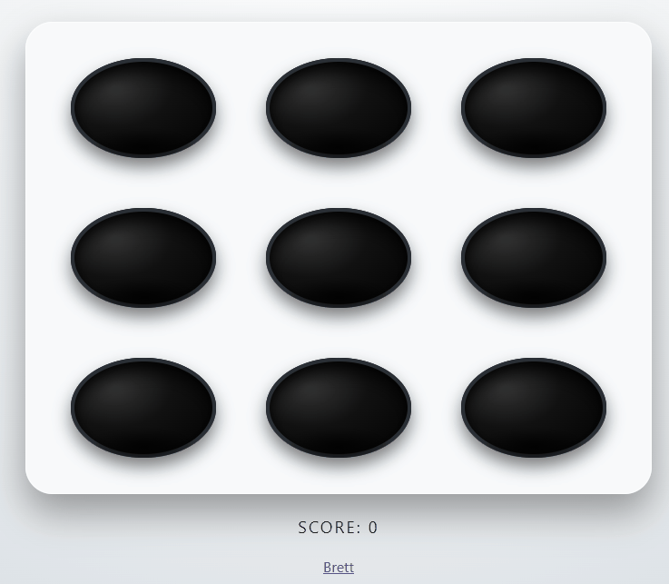
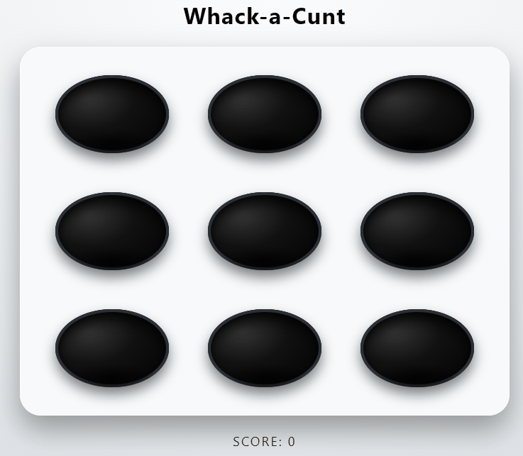
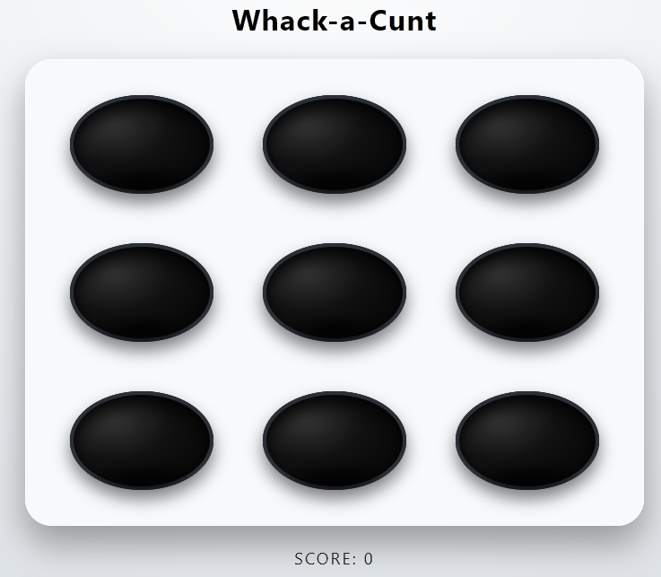

# **Whack-a-C*nt**  
*A browser-based parody game featuring America’s favorite judicial embarrassments.*

  

## 🧨 What Is This?
**Whack-a-C*nt** is a simple, savage little browser game where three Supreme Court extremists pop out of their holes — and your job is to smack them back into whatever swamp they crawled out of.

It’s a parody.  
It’s catharsis.  
It’s a stress-relief tool disguised as JavaScript.

Click/tap them to score points.  
Miss them, and they get to continue ruining fundamental rights — just like real life.

## 🎮 Features
- **Nine holes** for your judicial pests to appear from  
- **Three characters**:  
  - 👩‍🦰 *Amy Coney Barrett* — Handmaid Edition  
  - 🍻 *Brett Kavanaugh-Whatever* — Crying-About-Beer DLC included  
  - 👴🏾 *Clarence Whatever-His-Fuck-Is* — Corruption Expansion Pack  
- **Mobile support** (via `pointerdown` instead of `click`) so your anger is fully portable  
- **Randomized timing** so you can’t predict which asshole will appear next  
- **Live score counter** so you know exactly how much rage you’ve burned off  

## 🕹️ How to Play
1. Open `index.html` in a browser  
2. Wait for one of the three Justices to pop up  
3. **Tap or click** on their face  
4. Score goes up  
5. Hit them again  
6. Repeat until your mood improves

## 🛠️ Tech Stack
- **HTML** for structure  
- **CSS** for the glossy hole aesthetics and cursed vibes  
- **JavaScript** for:
  - Game loop  
  - Random mole timing  
  - Mobile-friendly input  
  - Score updates  

No dependencies.  
No frameworks.  
Just raw spite.

## 📱 Mobile Support Fix
Some mobile browsers delay `click` events by ~300ms, causing missed hits.  
This version uses:

```js
grid.addEventListener('pointerdown', handleWhack);
```

This makes taps register instantly so you can smack Brett without lag.

## 📂 File Structure
```
/
├── index.html
├── amy.gif
├── brett.gif
├── clarence.gif
└── README.md
```

## 🧹 Future Enhancements (Optional Chaos)
- Timer mode  
- Combo multiplier (“Rapid-F*ck-These-Guys mode”)  
- High-score leaderboard  
- Sound effects (gavel hits? angry screams?)  
- Difficulty settings (Roe-Overturned Edition)  

## ⚠️ Disclaimer
This project is **political parody** protected by free-speech laws.  
It does not endorse violence.  
It endorses *cartoonish emotional catharsis* in the face of very real political despair.

## ❤️ Contribute
Got ideas?  
Want new characters?  
Want to add animation, sound, or extra visual chaos?

PRs welcome.  
Snark encouraged.
